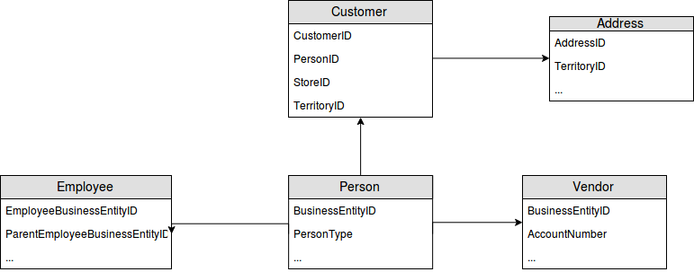
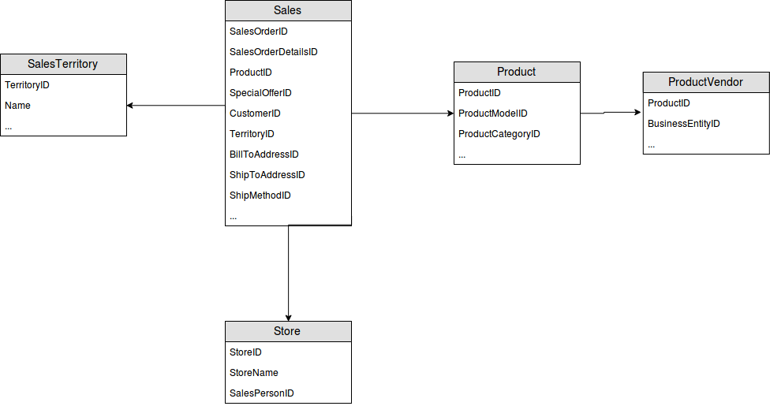
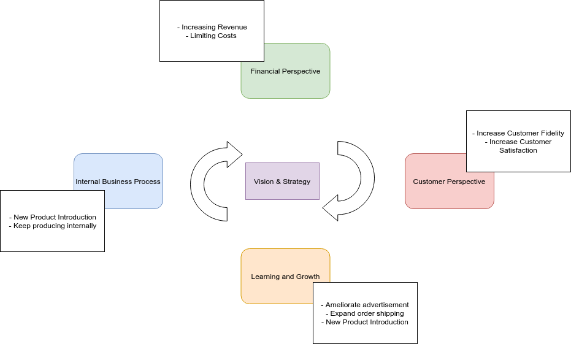
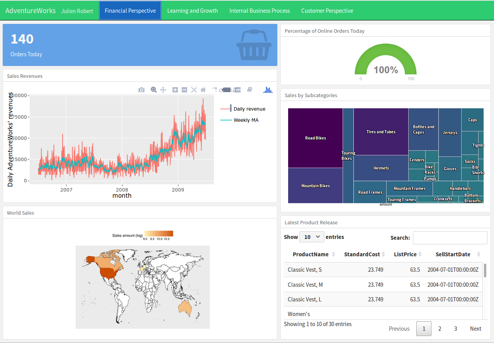
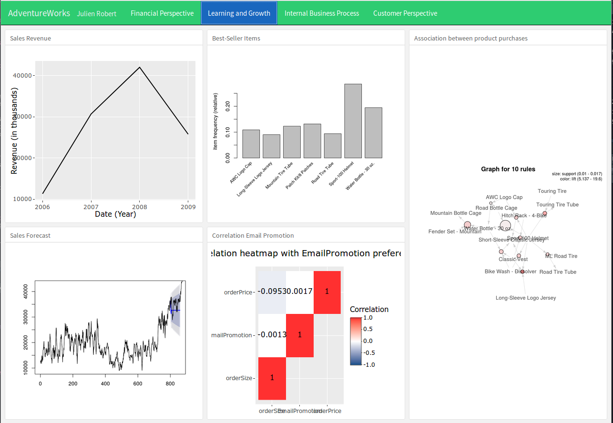
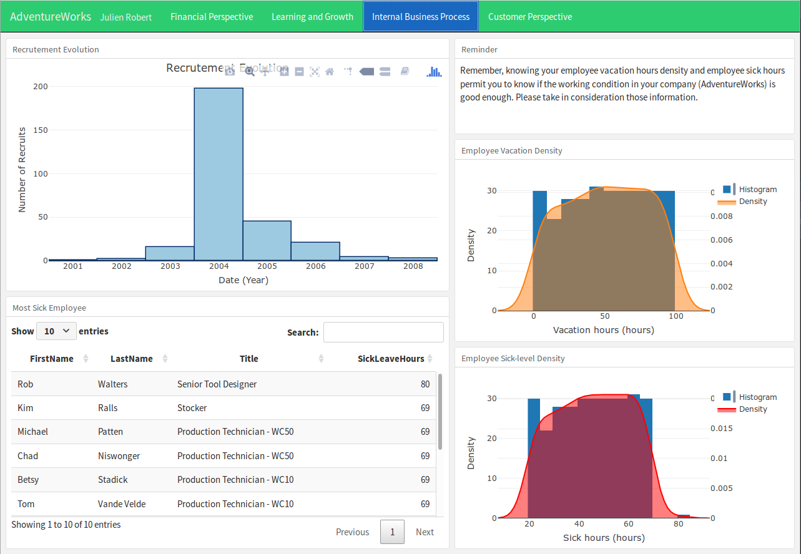
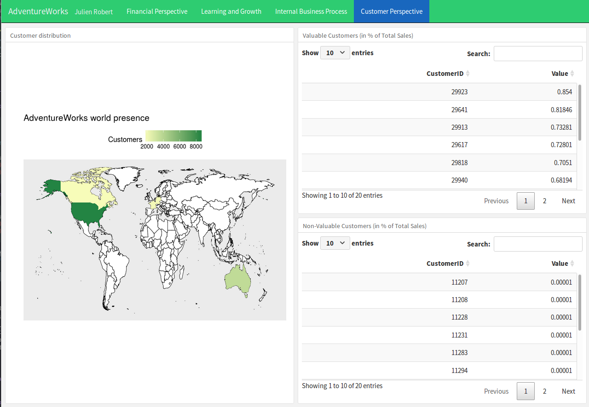

```{r setup, include=FALSE}
knitr::opts_chunk$set(echo = TRUE, warning = FALSE, message = FALSE)
library(RMySQL)
library(dplyr)
library(tidyr)
library(knitr)
library(kableExtra)
library(lubridate)
library(ltm)
library(ggplot2)
library(maps)
library(countrycode)
library(forecast)
library(tseries)
library(arules)
library(arulesViz)
library(reshape2)
```

# Introduction

Analysing an unknown company is somewhat difficult. There are some steps to follow to understand their data and core market. Understanding the historical data permits to possibly find problems in the business model or management of the company.

Those problems will be pointed out by the mean of a dashboard.

The database used is named _SalesDeveloper_. It was initially in the Microsoft Access database format, but has been converted into SQL queries, making it ready for importation in a MySQL database.

This report contains all the steps from understanding the data for discovering problems and present them to the CEO of the analyzed company. The analysis will be focused [on points which could lead to a drop in shares value](https://www.investopedia.com/articles/basics/04/100804.asp).

The _SalesDeveloper_ dataset have been selected because of its size; looking at the tables' dimensions only, the dataset seems large enough to perform an interesting and complete analysis.

# Reproducibility of this analysis

The analysis has been performed in R. The R environment will serve as the **Data Warehouse** for the study.

This report contains all the code used to visualize the data and perform the analysis.

Some packages are required and should be installed by running ```install.R```. Modifying ```util.R``` for importing the data using the login information of your database after having imported the sql files present in the _datasets_ folder is also needed.

Note that the process of converting the Microsoft Access to SQL queries have been already performed. The tables' relationships could not have been preserved but it is not an issue in our case. Importing the ```.sql``` files in a database named _salesdeveloper_ is the only step required.

# Understanding the data

To get an idea of how to proceed to understand the company we must represent and design how is represented the database. This can be done with a Snowflake Schema.

## Snowflackes Schema

By studing modeling the database we can notice that it is, even if it belongs to the same database, that we can model two snowflackes schema. One for the _people_ and one for the _sales_ of the company. Those can be joined easily with inner and full joints but do not respect the caractericts of a snowflakes schema.

\


\


## Pre-Analysis

Beginning with an empty R environment, we are going to proceed the analysis by establishing a connection to the database containing the data. The process of importing the data in MySQL will not be shown.

```{r include = FALSE}
# Connect to the database
mydb = dbConnect(MySQL(),
                 user = 'root',
                 password = 'root',
                 dbname = 'salesdeveloper',
                 host = '127.0.0.1')
```

```{r}
dblist <- dbListTables(mydb)
dblist
```

_SalesDeveloper_ contains thus ```r length(dblist)``` tables.
Looking only at the tables names, a brief idea of the content can be determined: it contains information about persons, customers, employees and sales made by the yet unknown company.

Looking at the structure of every tables, to get some insights about the data, is something smart to do. For that we first need to query the database to import all the data in R.

```{r}
queries <- paste0("SELECT * FROM ", dblist)

for (i in 1:length(queries)) {
  name <- paste0("SD", dblist[i])
  # Convert dataframe to tibble
  assign(name, as_tibble(dbGetQuery(mydb, queries[i])))
}
```

_Note, importing all the data will load it in the computer RAM, in our case, the dataset size make it not problematic. It, however, would be in case of Big Data with a very large dataset and thus other methods should be used._

```{r include = FALSE}
# Clean unused variables
rm(list = c("i", "name", "queries"))
```

```{r eval = FALSE}
ls.str(pattern = "SD", mode = "list")
```

While this output is non digest (and thus redacted — launching the command in a R environment permits to show the output), it already give us a good overview of the content of the dataset and permit us to start understanding the company.

The unknown company seems to have **```r nrow(SDEmployee)``` employees** for a total of **```r nrow(SDCustomer)```** or **```r nrow(SDAddress)```** customers (later analysis will permit to clarify if every customer needs to have an address).

The brief overview of the _Products_ tables give us a hint about the sales of the company. Their business seems to be focused on bikes, clothing, and accessories with an overall of **```r nrow(SDProduct)``` products**.

There is also a high possibility that the company sells products in the USA (cf the _SalesTerritory_ table) with their **```r nrow(SDStore)``` stores** and **```r nrow(SDVendor)``` vendors**.

The company seems, as well, to have performed **```r nrow(SDSalesOrderHeader)``` sales** at the time the database were extracted.

For the rest of the analysis the company will be named **AdventureWorks** (due to the employees emails domain).

Knowing who is the company, the interest will focus on **what could have been the reasons of the drop in the share value of AdventureWorks** reported by the CEO. 

# Exploring the data

Data have now been imported in the local Data Warehouse; closing the connection to the database is a good thing to do.
```{r}
dbDisconnect(mydb)
```

The first glance on the data can be correct, however, possible errors can be present in the dataset: duplicates or missing values that could have been added by mistake.

Fortunately, the data seem to be well-structured, we can thus study it by categories and start understanding better AdventureWorks.

## Internal Business Process - Employees

### Company size

Starting with the number of employees:

```{r}
nrow(SDEmployee)
```

The first glance showed that all employed seemed to be assigned to an ID. That ID should logically be unique.

```{r}
length(unique(SDEmployee$EmployeeBusinessEntityID))
```

There seems to be six duplicates. Looking further for understanding the problem is necessary.

```{r}
SDEmployee[duplicated(SDEmployee$EmployeeBusinessEntityID), ]
# Let's look at an example
which(SDEmployee$EmployeeBusinessEntityID == 16)
colnames(SDEmployee[249,] == SDEmployee[250,])[which((SDEmployee[249,] == SDEmployee[250,]) == FALSE)]
SDEmployee[249, ]$StartDate
SDEmployee[250, ]$StartDate
SDEmployee[249, ]$EndDate
```

At first sight the data of David Bradley seemed identical, however, possibly due to some mistakes, David seems to have been noted quitting AdventureWorks the August 15th 2004 but remployed the next day. David is thus the same person and should not be counted twice.
This is the case for the other duplicates.

```{r}
nrow(SDEmployee)/length(unique(SDEmployee$EmployeeBusinessEntityID))*100
```

Only 2% of the employees were duplicated. Which is, for the analysis, not significant.

Duplicates or data anomalies will be ignored in the rest of the analysis as the errors should not be significant in our problem finding and it is assumed that a tidy dataset have been given.

```{r include = FALSE}
SDEmployee <- SDEmployee[!duplicated(SDEmployee$EmployeeBusinessEntityID), ]
```

**AdventureWorks have thus 290 employees**.

Getting insights about the age distribution of the employees or their gender distribution is interesting, but will not help find a business problem.

```{r results = "asis"}
table(SDEmployee$Gender) %>%
    kable(format = "latex", caption = "Gender distribution",
      col.names = c("Gender", "Amount")) %>%
    kable_styling(latex_options = c("striped", "HOLD_position"))
```

However, the evolution of recruitment is a good key performance indicator related to the health of the enterprise.

```{r}
hist(year(ymd_hms(SDEmployee$HireDate)), xlab = "Date (Year)",
     ylab = "Number of Recruits", main = "AdventureWorks Recruitment Evolution",
     col = "lightblue")
```

Looking at the recruitment distribution we can see an **ending in 2008** and that the company has been **created in 2001**. 2004 must have been the year of the company expansion. Since then the recruitment slowed down **which could mean a drop in the sales, bad focus of the company, or bad working conditions of the workers**.

### Employee _out-of-work_-level

The data contain information about sick leave hours, an anormaly high normal of sick leave could point a problem with the work condition at AdventureWorks. Let's find out the good and bad people.

```{r}
which(SDEmployee$SickLeaveHours == max(SDEmployee$SickLeaveHours))
paste(SDEmployee[242, ]$FirstName, SDEmployee[242, ]$LastName)
```

```{r}
sickemp <- density(SDEmployee$SickLeaveHours)
plot(sickemp, main = "Sick Leave Hours of AdventureWorks employees", xlab = "Sick hours")
polygon(sickemp, col = "darkorchid1", border = "black")
```

Most of the employees are sick for the same amount of time and those numbers correspond to the [mean average of the USA](https://www.bls.gov/news.release/ebs.t05.htm), country where AdventureWorks seems to be. The lack of context of the data does not permit us to make any conclusion about that density plot.

Even if discrimination is illegal, it might be interesting to see if there is a pattern between being sick and married, or sick and taking holidays. Due to the type of the marital status variable (non continuous) using the Biserial correlation in place of the Pearson correlation is necessary.

```{r}
biserial.cor(SDEmployee$SickLeaveHours, SDEmployee$MaritalStatus)
cor(SDEmployee$SickLeaveHours, SDEmployee$VacationHours)
```

As expected, there is no correlation between being sick and maried. However, it seems that people being the most sick are the one taking more vacation, but once again, the lack of context does not permit to lead to any formal conclusion.

```{r}
vacemp <- density(SDEmployee$VacationHours)
plot(vacemp, main = "Vacation Hours of AdventureWorks employees", xlab = "Vacation hours")
polygon(vacemp, col = "darkorange1", border = "black")
```

The employees seem to be in overall normal health compared to the [mean-average in the United States](https://www.bls.gov/news.release/ebs.t05.htm).

### Salary distribution

[Salary and promotion are as well a motor of employee performances](https://hbr.org/2013/04/does-money-really-affect-motiv), if the company is not going well, one reason could be a lack of employee motivation giving bad results or bad products quality.

```{r results = "asis"}
salRep <- sapply(unique(SDEmployee$DepartmentName),
       function(x) mean(SDEmployee$BaseRate[SDEmployee$DepartmentName == x])) %>%
      sort()
salRep <- data.frame(Var1 = names(salRep), salRep) %>%
        as_tibble() %>%
        inner_join(as_tibble(as.data.frame(table(SDEmployee$DepartmentName))),
                   by = "Var1") %>%
        kable(format = "latex", caption = "Mean-Average Salary by departement",
          col.names = c("Department", "Base Rate", "Employees")) %>%
        kable_styling(latex_options = c("striped", "HOLD_position"))
salRep
```

```{r}
round(max(SDEmployee$BaseRate) / min(SDEmployee$BaseRate))
```

Apart from the difference of salary between the less paid workers and the CEO with a factor of 14, it is noticeable that most of the employees are in the production department. Because they supposedly build the products sold their satisfaction must be important.
Assuming that all workers are working in the USA and the _Base Rate_ corresponds to the hourly salary in dollars, we get a salary of about ```40*(52-5)*14``` = 26,000\$ per year. That salary is above the [minimum US wage](https://en.wikipedia.org/wiki/Minimum_wage_in_the_United_States).

Salary of employees should thus **not** interfere with the performance of the companies based on the assumption defined earlier.

**The problem of AdventureWorks is therefore not due to its staff.**

Those information permit to define the folowing **Key Performance Indicators**:

* Evolution of recruitment – the evolution of AdventureWorks recruitment over time
* Employee Health – defined thanks to their vacation and holiday time compared to the mean-average in the USA

## Financial Perspective - Products

To understand better AdventureWorks it is necessary to understand in which market they are (what do they produce and sell). Firstly the products information in their database were split in multiple tables. We need to join them for a simpler analysis and a better Data Warehouse design.

```{r}
# Left join to get all subcategories
names(SDProduct)[names(SDProduct) == "Name"] <- "ProductName"
SDProduct <- left_join(SDProduct, SDProductSubcategory, by = "ProductSubcategoryID")
# Small cleaning
rm(SDProductSubcategory)
SDProduct$ProductSubcategoryID <- NULL
names(SDProduct)[names(SDProduct) == "Name"] <- "SubcategoryName"
# Left join to get all categories
SDProduct <- left_join(SDProduct, SDProductCategory, by = "ProductCategoryID")
# Small cleaning
rm(SDProductCategory)
SDProduct$ProductCategoryID <- NULL
names(SDProduct)[names(SDProduct) == "Name"] <- "CategoryName"
# Left join to get all model information
SDProduct <- left_join(SDProduct, SDProductModel, by = "ProductModelID")
# Small cleaning
rm(SDProductModel)
SDProduct$ProductModelID <- NULL
names(SDProduct)[names(SDProduct) == "Name"] <- "ModelName"
# Removing empty or mistaken columns
SDProduct$DiscontinuedDate <- NULL
SDProduct$SellEndDate <- NULL
# Convert dates in date format
SDProduct$SellStartDate <- ymd_hms(SDProduct$SellStartDate)
# Looking a the Product tibble dimension
dim(SDProduct)
```

During this analysis it appeared no products were discontinued (columns containing _NA_) and none contained an set _SellEndDate_ (whenever they did, the end date was one day before the _SellStartDate_, which is impossible), the corresponding columns has been dropped.

### Type of products

Further investigation shows that the company produces pieces and finished goods totaling 504 items. Those finished goods are all associated with a product (sub-)category and a price, whereas non finished goods are not. This is because AdventureWorks build themselves their pieces for their products but do not sell them.

```{r}
# Verifying if non finished goods have been ever sold
anti_join(SDProduct, SDSalesOrderDetail, by = "ProductID")$FinishedGoodsFlag  %>%
   length() -
  anti_join(SDProduct, SDSalesOrderDetail, by = "ProductID")$FinishedGoodsFlag %>%
  as.numeric() %>%
  sum()
table(SDProduct$FinishedGoodsFlag)
```

This leave us **295 products** for sales.

Looking at the product release date, we notice that most of the new products were released in 2004. This year coincide with the employee expansion of AdventureWorks. However, it seems that no new products were released after this date. 

```{r}
hist((year(SDProduct$SellStartDate)), xlab = "Date (Year)",
     ylab = "Number of Products Created", main = "AdventureWorks' new Products Evolution (with Finished Goods)",
     col = "firebrick1")
```

Shareholders are mostly interested by external processes of the company and thus the products they sell. We will hence omit the non finished goods assuming AdventureWorks manage its productions correctly.

```{r}
SDProduct <- subset(SDProduct, SDProduct$FinishedGoodsFlag == "1")
SDProduct$FinishedGoodsFlag <- NULL
```

```{r}
hist((year(SDProduct$SellStartDate)), xlab = "Date (Year)",
     ylab = "Number of Products Released", main = "AdventureWorks' new Products Evolution",
     col = "darkorchid1")
```

### Product margin

Each product in sale have a category and a sub-category, as mentioned earlier, and have of listing price and a cost of production. It is interesting to unterstand which categories lead to the higher margin. It permit to draw a business strategy in accordance to the profits.

```{r}
SDProduct <- SDProduct %>%
  mutate(ProfitMargin = round((ListPrice - StandardCost) / ListPrice * 100))
```

```{r results = "asis"}
SDProduct %>%
  group_by(CategoryName) %>%
  # The currency does not matter in the average of the prices
  summarise(PriceMean = mean(ListPrice), ProfitMean = mean(ProfitMargin),
            DayReadyMean = mean(DaysToManufacture)) %>%
  kable(format = "latex", caption = "Product Category Margin",
          col.names = c("Category", "Average Price", "Margin (%)", "Days Ready")) %>%
  kable_styling(latex_options = c("striped", "HOLD_position"))
```

In the table above it is noticeable that the most profitable items are the less time-costly to produce and the less expensive. While those products are profitable they need to be sold in higher quantity to attain equivalent revenue of selling a product from another category.

Note, those levels could be biased if products from the same category have completely different margin (looking at sub-category would be better but too much verbose). We thus will not investigate that case further.

**AdventureWorks should hence link the purchase of those items with others less profitable category**.

We are going to determine if they already apply that process; if not, we will use that information as a key performance indicator for the enterprise.

Those information permit to define the folowing **Key Performance Indicators**:

* Product release information
* Popular product categories – information about how perform a sub-categories (how sales are split)

## Financial Perspective - Sales

The company decided, as for the _Products_ table, to split their data in multiple tables. The same process of unifying those data in one table for a quicker analysis and a better Data Warehouse design will be made.

```{r}
# Merge orders and location
SDSales <- left_join(SDSalesOrderHeader, SDSalesTerritory, by = "TerritoryID")
names(SDSales)[names(SDSales) == "Name"] <- "TerritoryName"
names(SDSales)[names(SDSales) == "Group"] <- "TerritoryGroup"
SDSales$TerritoryID <- NULL
SDSales$TerritoryGroup <- NULL
rm(SDSalesOrderHeader)
# Merge products of orders with orders
SDSales <- inner_join(SDSales, SDSalesOrderDetail, by = "SalesOrderID")
SDSales$SalesOrderID <- NULL
SDSales$SalesOrderDetailID <- NULL
rm(SDSalesOrderDetail)
# Convert dates in date format
SDSales$OrderDate <- ymd_hms(SDSales$OrderDate)
SDSales$DueDate <- ymd_hms(SDSales$DueDate)
SDSales$ShipDate <- ymd_hms(SDSales$ShipDate)
# Verify for duplicates
length(unique(SDSales$CustomerID)) == length(unique(SDSales$AccountNumber))
SDSales$AccountNumber <- NULL
SDCustomer$AccountNumber <- NULL
```

_SDSales_ contains now all the relevant information for extracting easily knowledge from the table.

### Sales revenue

Seeing the evolution of the revenue of the company permit give us a good idea of their financial health.

```{r}
SDSales %>%
  mutate(orderTotal = (UnitPrice - (UnitPrice * UnitPriceDiscount)) * OrderQty) %>%
  group_by(year(OrderDate)) %>%
  summarise(revenue = sum(orderTotal)) %>%
  ggplot(aes(x = `year(OrderDate)`, y = revenue / 1000)) +
  geom_line() +
  labs(x = "Date (Year)", y = "Revenue (in thousands)", title = "AdventureWorks' revenue") +
  theme(legend.position = "top")
max(SDSales$OrderDate)
```

Note that the conversion change of the currency has not been taken in account because insignificant in our case.

Even if we see a drop in the revenue of the enterprise, we have to remember that the sales in our dataset stop in June 2009, meaning that the revenue should continue to add up for the rest of the year.

It is even more interesting to see if we can forecast those revenues. We will investigate that question in the next section and use that information as a KPI; but so far, we can determine that AdventureWorks is in great health.

### Geographical sales distribution

```{r}
worldMap <- map_data("world") %>%
            subset(region != "Antarctica")
SalesRep <- table(SDSales$CountryRegionCode) %>%
            as.data.frame() %>%
            as_tibble()
names(SalesRep) <- c("Country", "Sales")

# Rename iso2 country code to country names
SalesRep$Country <- countrycode(SalesRep$Country, "iso2c", "country.name")
# Rename USA to be shown in ggplot
SalesRep$Country[SalesRep$Country == "United States"] <- "USA"

SalesMap <- ggplot() +
            geom_map(dat = worldMap, map = worldMap, aes(map_id = region),
                     fill = "white", color = "black", size = 0.25) +
            geom_map(dat = SalesRep, map = worldMap, aes(map_id = Country,
                    fill = log(Sales)), size = 0.25) +
            scale_fill_gradient(low = "#fff7bc", high = "#cc4c02",
                    name = "Sales amount (log)") +
            expand_limits(x = worldMap$long, y = worldMap$lat) +
            labs(x = "", y = "", title = "World sales distribution of AdventureWorks") +
            theme(panel.grid = element_blank(), panel.border = element_blank()) +
            theme(axis.ticks = element_blank(), axis.text = element_blank()) +
            theme(legend.position = "top")
SalesMap
SalesRep
```

As we see, AdventureWorks sales are split across six countries. Six developed countries and world power. Their inhabitants have [a higher purchasing power](https://en.wikipedia.org/wiki/List_of_countries_by_average_wage) than the rest of the world; AdventureWorks' product prices should take it in account.

Moreover the company performs the majority of its sales in the USA, which could be due to the fact that majority of their stores might be in that country.

```{r}
dim(SDStore)
StoresRep <- SDStore %>%
  left_join(SDEmployee, by = c("SalesPersonID" = "EmployeeBusinessEntityID")) %>%
  left_join(SDSalesTerritory, by = c("SalesTerritoryKey" = "TerritoryID")) %>%
  group_by(CountryRegionCode) %>%
  summarise(sales = n())

StoresRep$CountryRegionCode <- countrycode(StoresRep$CountryRegionCode, "iso2c", "country.name")
StoresRep$CountryRegionCode[StoresRep$CountryRegionCode == "United States"] <- "USA"
StoresRep$CountryRegionCode[StoresRep$CountryRegionCode == "United Kingdom"] <- "UK"

par(las = 2) # Labels perpendicular to axis
barplot(StoresRep$sales, names.arg = StoresRep$CountryRegionCode, horiz = TRUE,
        main = "AdventureWorks stores", xlab = "Amount of Stores", ylab = "",
        col = "lightblue", cex.names = 0.8)

mean(as.numeric(SDSales$OnlineOrderFlag))
```

That is indeed the case, ```r StoresRep[StoresRep$CountryRegionCode == "USA", ]$sales``` out of their ```r nrow(SDStore)``` stores are in the United States.

However, as **almost half of their sales are online** this shows **a lack of market penetration / marketing** is the other countries.

**This issue could be one the main reason of why the share value of AdventureWorks dropped**. The above world map is thus relevant for the managers for seeing the progression of their sales in the world.

### Categorical sales distribution

Earlier in the analysis, we were wondering about the distribution of the company sales by category to determine if AdventureWorks were selling enough of their highly profitable products.

Estimating the average time of when accessories are purchased in an order compared other categories is thus relevant.

```{r result = "asis"}
SDSales %>%
  inner_join(SDProduct, by = "ProductID") %>%
  group_by(SalesOrderNumber, CategoryName) %>%
  summarise(amount = n()) %>%
  group_by(CategoryName) %>%
  summarise(rep = round(n() / length(unique(SDSales$SalesOrderNumber)) * 100)) %>%
  kable(format = "latex", caption = "Probabilty of being in order",
          col.names = c("Category", "Probability (%)")) %>%
  kable_styling(latex_options = c("striped", "HOLD_position"))
```

We remark that there is 60% of chance for an accessory to be bought in an order, as much as a bike. This is thus very good. AdventureWorks sales representatives manage thus efficiently their sales.

### Customer engagement

```{r}
length(unique(SDSales$SalesOrderNumber)) / length(unique(SDSales$CustomerID))
```

Client loyalty is important in the sector of our company, as we already notice most of the order contains a bike. This is good because the revenues are important, but not in the long-term. Clients need to come back in AdventureWorks to buy more accessories or clothes.

An average of **```r length(unique(SDSales$SalesOrderNumber)) / length(unique(SDSales$CustomerID))``` orders per client is clearly insufficient** and could have possibly worried investors. Client loyalty must thus imperatively be a KPI taken in account by the managers of the company.

Another sign of customer engagement is their interest of buying new products. We will not investigate that case here because of the lack of available data for this matter.

Those information permit to define the folowing **Key Performance Indicators**:

* Sales distribution - location of AdventureWorks' sales
* Figure about Online orders
* Sales Revenue
* Customer fidelity – with figures showing how many times customers have placed an order in average

## Customer Perspective - Customer

AdventureWorks seems to have many customers across the world based on their stores and sales. Their customers data are stored in the _Customer_ table.

```{r}
length(unique(SDCustomer$CustomerID)) == length(SDCustomer$CustomerID)
nrow(SDCustomer)
names(SDCustomer)
nrow(anti_join(SDCustomer, SDSales[!duplicated(SDSales$CustomerID), ], by = "CustomerID"))
```

There is ```r nrow(SDCustomer)``` customers and no duplicates. AdventureWorks got as well on nice return on registration, only ```r round(nrow(anti_join(SDCustomer, SDSales[!duplicated(SDSales$CustomerID), ], by = "CustomerID")) / nrow(SDCustomer) * 100)```% of their registered customer never placed an order.

```{r}
sum(is.na(SDCustomer$TerritoryID))
```

Each customer is assigned to a _TerritoryID_. That property permit to determine the distribution of AdventureWorks' customers across the world.

```{r}
worldMap <- map_data("world") %>%
            subset(region != "Antarctica")
custRep <- inner_join(SDCustomer, SDSalesTerritory, by = "TerritoryID")
custRep <- table(custRep$CountryRegionCode) %>%
            as.data.frame() %>%
            as_tibble()
names(custRep) <- c("Country", "Customers")

# Rename iso2 country code to country names
custRep$Country <- countrycode(custRep$Country, "iso2c", "country.name")
# Rename USA to be shown in ggplot
custRep$Country[custRep$Country == "United States"] <- "USA"

custMap <- ggplot() +
            geom_map(dat = worldMap, map = worldMap, aes(map_id = region),
                     fill = "white", color = "black", size = 0.25) +
            geom_map(dat = custRep, map = worldMap, aes(map_id = Country,
                     fill = Customers), size = 0.25) +
            scale_fill_gradient(low = "#f7fcb9", high = "#238443", name = "Customers") +
            expand_limits(x = worldMap$long, y = worldMap$lat) +
            labs(x = "", y = "", title = "AdventureWorks world presence") +
            theme(panel.grid = element_blank(), panel.border = element_blank()) +
            theme(axis.ticks = element_blank(), axis.text = element_blank()) +
            theme(legend.position = "top")
custMap
```

The map looks very similar to the _World sales distribution of AdventureWorks_, there is no customers outside of the country in which they have stores. This is an element to improve as they provide online ordering.

Unfortunately the _Customer_ table does not contain much information about those customers; those information are contained in the _Person_ table.

Those information permit to define the folowing **Key Performance Indicators**:

* Customer distribution – location of AdventureWorks' clients

## Learning and Growth - Person

The _Person_ table contains information about people and those people are categorized by _PersonType_. Without any context it is impossible to understand what the values stand for.

A web search point us to [an explaination](https://dataedo.com/download/AdventureWorks_Tables_Person.pdf). It appears that _EM_ corresponds to _Employee (non-sales)_, _GC_ to _General Contact_, _IN_ represents the _Individual (retail) customers_, moreover _SC_ corresponds to _Store Contact_, _SP_ to _Sales Person_ and finally _VC_ are _Vendor Contact_. Our interest here is about the customers.

```{r}
table(SDPerson$PersonType)
SDPersonCust <- subset(SDPerson, SDPerson$PersonType == "IN")
dim(SDPersonCust)
```

Knowing the dimension of the tables we understand that not all customers are registered in the _Person_ table, but most of them are.

The table contains an interesting column named _EmailPromotion_ where _0_ means the "contact does not wish to receive e-mail promotions", _1_ signify that the"contact does wish to receive e-mail promotions from AdventureWorks" and _2_ the "contact does wish to receive e-mail promotions from AdventureWorks and selected partners".

We will investigate if the number of email promotion influence the number of order of the opt-in customers. In that case, sending email by default could be a good solution for increasing AdventureWorks sales.

```{r}
table(SDPersonCust$EmailPromotion)
```

It is easy to notice that defaulting the advertisement mail sending is not something already in place to the high-level of output.

```{r}
SDSalesEmailPromo <- SDCustomer %>%
  full_join(SDSales, by = "CustomerID") %>%
  full_join(SDPersonCust, by = c("PersonID" = "BusinessEntityID")) %>%
  group_by(SalesOrderNumber, CustomerID, EmailPromotion) %>%
  summarise(orderSize = sum(OrderQty),
            orderPrice = sum((UnitPrice - (UnitPrice * UnitPriceDiscount)) * OrderQty))
```

Merging all the customers with their sales and linking them with their sales (even those who never ordered anything) permit us to see the relevance of the promotion email. Nonetheless, full joining inserted _NA_ in our Data WareHouse, for the orderPrice and orderSize it make sense to replace those _NAs_ by 0 whenever the _EmailPromotion_ field is set.

```{r include = FALSE}
# http://www.sthda.com/english/wiki/ggplot2-quick-correlation-matrix-heatmap-r-software-and-data-visualization
get_upper_tri <- function(cormat) {
  cormat[lower.tri(cormat)] <- NA
  return(cormat)
}

reorder_cormat <- function(cormat){
  # Use correlation between variables as distance
  dd <- as.dist((1 - cormat) / 2)
  hc <- hclust(dd)
  cormat <- cormat[hc$order, hc$order]
}
```

```{r}
# Tidying data
SDSalesEmailPromo <- subset(SDSalesEmailPromo, !is.na(SDSalesEmailPromo$EmailPromotion))
SDSalesEmailPromo[is.na(SDSalesEmailPromo$orderSize), ]$orderPrice <- 0
SDSalesEmailPromo[is.na(SDSalesEmailPromo$orderSize), ]$orderSize <- 0

# Create correlation matrix
cormat <- round(cor(SDSalesEmailPromo[-c(1, 2)]), 4)
melted_cormat <- cormat %>%
  reorder_cormat() %>%
  get_upper_tri() %>%
  melt(na.rm = TRUE)

ggplot(data = melted_cormat, aes(x = Var1, y = Var2, fill = value)) + 
  geom_tile(color = "white") +
  scale_fill_gradient2(low = "dodgerblue4", high = "firebrick1", mid = "white",
                       midpoint = 0, limit = c(-1,1), space = "Lab",
                       name = "Correlation") +
  coord_fixed() +
  labs(x = "", y = "", title = "Correlation heatmap with EmailPromotion preferences") +
  coord_fixed() +
  geom_text(aes(Var1, Var2, label = value), color = "black", size = 4)
```

```{r results = "asis"}
# Prepare data for visualization - extracting useful information
SDSalesEmailPromo %>%
  group_by(CustomerID) %>%
  summarise(emailPromotion = sum(EmailPromotion) / n(),
            meanOrderQty = mean(sum(orderSize)),
            meanOrderPrice = mean(sum(orderPrice))) %>%
  group_by(emailPromotion) %>%
  summarise(orderQty = mean(meanOrderQty), orderPrice = mean(meanOrderPrice)) %>%
  kable(format = "latex",
        caption = "Average Order Quantity and Price depending on EmailPromotion setting",
        col.names = c("EmailPromotion", "Order Quantity", "Order Price")) %>%
  kable_styling(latex_options = c("striped", "HOLD_position"))
```

It is noticeable that AdventureWorks does not make any benefit using their advertisement method. It means that they are not using email promotion effectively. They should improve that factor imperatively as it common knowledge that advertisements increase sales, especially email promotion which has, normally, the highest engagement rate.

Those information permit to define the folowing **Key Performance Indicators**:

* Efficiency of email promotion

# Helping the company

After having understood the data, we can know affirm that we have a good idea of the company, its issues and points to focus on. Knowing as well since the beginning of the analysis the vision of the CEO of AdventureWorks it permits us to draw a Balanced Scorecard for helping the managers to meet the defined objectives.

## Balanced Scorecard

* Focusing on the **Customer Perspective**, we discovered in AdventureWorks' data that their customer engagement was low: clients were doing a limited amount of order at the shop. AdventureWorks work must thus on their client satisfaction and loyalty which will lead to an increased amount of orders per clients.

* About the **Financial Perspective**, we learned that the company was doing a merely good job, with a constant increasing of their revenues and a limit amount of increasing of their workers. The objective should thus keep increasing their revenues while limiting their costs (by continuing producing their own pieces).

* **Learning and Growth** was the weak point of AdventureWorks, they are growing in sales and customers, but do not retain them. They, as well, failed at basic marketing strategy (email promotion). This is the main perspective the managers should focus on by ameliorating their advertisement methods, by shipping online orders all over the world instead of the countries they are present. This part is definitely what made fear the shareholders and led to a drop in the share value.

* Finally, for their **Internal Business Process** perspective, we saw that their sales employees were doing a good job at pushing client to buy accessories with an order and were in their country average for their health and salary. It was, as well, noticeable that no new products were released after 2004; developing and releasing new products must thus be their focus in that perspective.  

\ 

\ 

## Key Performance Indicators

We have already defined interesting KPIs in [Understanding the data](#understanding-the-data). It is, however, good to recall most of those metrics:

* Evolution of recruitment – the evolution of AdventureWorks recruitment over time
* Employee Health – defined thanks to their vacation and holiday time compared to the mean-average in the USA

* Product release information
* Popular Product categories – information about how perform a sub-categories (how sales are split)

* Sales distribution - location of AdventureWorks' sales
* Figure about Online orders
* Sales Revenue
* Customer fidelity – with figures showing how many times customers have placed an order in average

* Customer distribution – location of AdventureWorks' clients

* Sales revenue prospect – Prediction of sales earnings
* Efficiency of email promotion

As the company business model have been evaluated and goals defined, thanks to their historical data it will be possible to predict, in a more or less accurate way, business-driven figures for helping the decision making of AdventureWorks' managers.

## Figures prediction

Out of all those key performance indicator, two have been picked as the most relevant for the company (i.e. where AdventureWorks were struggling the most). In the next section we will try to predict the sales revenues of AdventureWorks with their historical data and try to see any pattern in the buying habit of their customers for a more specific email advertisement targeting.

### Revenue prediction

Forecasting revenues and sales is an interesting information for the managers of AdventureWorks, they can see if, following their current strategy they can increase of decrease their benefits.

For this trial of forecasting we will use an **autoregressive integrated moving average** (ARIMA). We, however, will not enter in details about of how that works. [Litterature](https://www.datascience.com/blog/introduction-to-forecasting-with-arima-in-r-learn-data-science-tutorials) which was used to build that model can be found online.

```{r}
SDSalesRev <- SDSales %>%
  mutate(orderTotal = (UnitPrice - (UnitPrice * UnitPriceDiscount)) * OrderQty) %>%
  group_by(OrderDate) %>%
  summarise(revenue = sum(orderTotal))

# Clean outliers from dataset
SDSalesRev$clean_rev <- ts(SDSalesRev[, 'revenue']) %>%
  as.vector() %>% # Small trick to fix issue 'time series not univariate'
  ts() %>%
  tsclean()

# Create Daily and Monthly Moving Average for removing volatility
SDSalesRev$rev_ma <- ma(SDSalesRev$clean_rev, order = 7)
SDSalesRev$rev_ma30 <- ma(SDSalesRev$clean_rev, order = 30)

# Plot Daily revenue to look for pattern
ggplot() +
  geom_line(data = SDSalesRev, aes(x = as.Date(OrderDate),
                                    y = clean_rev, colour = "Daily revenue")) +
  geom_line(data = SDSalesRev, aes(x = as.Date(OrderDate),
                                   y = rev_ma,   colour = "Weekly Moving Average"))  +
  geom_line(data = SDSalesRev, aes(x = as.Date(OrderDate),
                                   y = rev_ma30, colour = "Monthly Moving Average"))  +
  scale_x_date('month') +
  scale_y_continuous() +
  labs(x = "Date", y = "Daily AdventureWorks' revenues")
  
# Calculate Seasonal component (fluctuation based on calendar cycle)
rev_ma = ts(na.omit(SDSalesRev$rev_ma), frequency = 30)
decomp = stl(rev_ma, s.window = "periodic") # calculate seasonal comp
deseasonal_rev <- seasadj(decomp)
plot(decomp)

# Stationary test
adf.test(rev_ma, alternative = "stationary") # Stationary rejected

# Autocorrelations and Model Order
# display correlation between series and lags
Acf(rev_ma, main = '')
# diplay correlation between variable and lags non explained by previous lags
Pacf(rev_ma, main = '')

# Stationary test after differencing (by 1)
rev_d1 = diff(deseasonal_rev, differences = 1)
plot(rev_d1)
adf.test(rev_d1, alternative = "stationary") # Stationary test approved

Acf(rev_d1, main = 'ACF for Differenced Series') # Significant correlation at lag 9
Pacf(rev_d1, main = 'PACF for Differenced Series') # Significant correlation at lag 7

# Fitting ARIMA model
fit <- auto.arima(deseasonal_rev, seasonal = FALSE)
fit

# Check validity
tsdisplay(residuals(fit), lag.max = 60, main = '(0,1,0) Model Residuals')
fit2 <- arima(deseasonal_rev, order = c(0,1,9))
fit2 # AIC smaller than first fit
tsdisplay(residuals(fit2), lag.max = 30, main = '(0,1,9) Model Residuals')

# Forecasting values
fcast <- forecast(fit2, h = 30)
plot(fcast)

# Testing model
hold <- window(ts(deseasonal_rev), start = 800)

fit_no_holdout = arima(ts(deseasonal_rev[-c(800:max(deseasonal_rev))]), order = c(0,1,9))

fcast_no_holdout <- forecast(fit_no_holdout, h = 60)
plot(fcast_no_holdout, main = " ")
lines(ts(deseasonal_rev))
```

The naive model have been built and tested. We can see that on real data it performs kind of badly. The blue line, representing the forecast, is not really performing as expected. However, this model can serve as base for building more well performing models. It will be shown in the dashboard as long as no better performing model is found.

### Customers' habits detection

Finding habits of customers is a [relevant information](https://www.kdnuggets.com/2016/04/association-rules-apriori-algorithm-tutorial.html) which will permit to improve the marketing strategy of AdventureWorks. As we saw, they were performing not so well about getting profit out of their email promotion methods. Clustering their customers into specific groups will permit to send personalized advertisements permitting to increase their sales and do interesting recommendation.

We must thus find rules about customers' habits according to what they already bought. AdventureWorks developers will then be able to clusters (programmatically) those people into groups or change the placement of their product in their store for facilitating the shopping of their clients.

```{r}
# explaination https://www.r-bloggers.com/association-rule-learning-and-the-apriori-algorithm/

# we subset SDSales to get the purchase from the last year only
SDSalesDev <- subset(SDSales, year(SDSales$OrderDate) == max(year(SDSales$OrderDate))) %>%
  left_join(SDCustomer, by = "CustomerID") %>%
  left_join(SDPersonCust, by = c("PersonID" = "BusinessEntityID")) %>%
  left_join(SDProduct, by = "ProductID")

# Cleanup dataframe
SDSalesDev2 <- SDSalesDev[, c("CustomerID", "StoreID", "OnlineOrderFlag", "SalesOrderNumber",
                       "OrderQty","UnitPrice", "UnitPriceDiscount", "EmailPromotion",
                       "SpecialOfferID", "OrderDate", "ShipDate", "CountryRegionCode",
                      "ProductName", "CategoryName", "SubcategoryName", "ProfitMargin")]

SDSalesDev <- SDSalesDev2[, c("SalesOrderNumber", "ProductName")]
# Clean product names by removing color / size
SDSalesDev$ProductName <- sub('\\s*,.*', '', SDSalesDev$ProductName)
SDSalesDev <- as.data.frame(unclass(SDSalesDev))
SDSalesDev$ProductName <- as.factor(SDSalesDev$ProductName)

# Dataframe in a "single" form and not "basket"
trans4 <- as(split(SDSalesDev[,2], SDSalesDev[,1]), "transactions")

# Create rules using Apriori algorithm
rules <- apriori(trans4, parameter = list(support = 0.01, confidence = 0.8,
                                          minlen = 2,maxlen = 15))
# redacted
# inspect(head(sort(rules, by = "lift"), 10));
```

AdventureWorks does not have a large enough numbers of orders or any top-seller to be able to choose a support (i.e. how popular an items is) greater than 0.01 and getting interesting rules. Apart if the managers are interested about knowing they sell a lot of water bottles when they sell the cage for it or tire tubes when they sell tires, which is all already pretty intuitive, the support needs to be lowered.

```{r}
itemFrequencyPlot(trans4, support = 0.09, cex.names = 0.8)
```

The confidence says how likely a product is purchased if another product is; we have set that preference at 80% to get a good insight of the most purchased together products. We filter our choice by the greater lift as it represents the likeness of an item to be bought with another without getting the popular interference that the confidence can get. 

After inspection, we can determine patterns which can help the managers.

Note: The _inspect_ command gives a too large output for the report. Please run the command directly in your R interpreter.

```{r}
#showing more rules is better, but the graphs get unreadable
#plot(head(sort(rules, by = "confidence"), 30), method = "graph")
plot(head(sort(rules, by = "confidence"), 10), method = "graph")
plot(head(sort(rules, by = "confidence"), 10))
```

# Showing the data

```{r eval = FALSE, include = FALSE}
# save R data for easier reproducibility and grading
save.image()
```

## Dashboard

All the information shown is this analysis can be useful for AdventureWorks. However, creating a dashboard permits to the managers to make decisions more easily than a report about their weak points. The so-created dashboard can be found in the ```dashboard.html``` file while its source code in ```dashboard.Rmd```.

That dashboard is composed of the following caracteristics, derived from the Balance Scorecard defined earlier:

* A tab _Financial Perspective_ displaying information about onlines sales, most purchased categories or a map of the sales in the world
* A tab _Learning and Growth_ which use the models defined previously and show the progress of AdventureWorks. Even if the images seem static (they loaded in FlexDashboard with R, see source-code, the graph are updated each time the dashboard is built with the latest data)
* A tab _Internal Business Process_ showing insight about health of employee and recruitement.
* A tab _Customer Perspective_ displaying the customer distribution of AdventureWorks in the world and some others figures.

\


\


\


\


## Solution Evaluation

The dashboard have been created based on information extracted from the given data of AdventureWorks. Its goals is to permit AdventureWorks' managers to make decisions for keeping their share value increasing by ameliorating their marketing and other part of their business and hence, please their CEO.

However, to know if the charts stay efficient with time, we must test the efficiency of the dashboard by conducting an evaluation. That evaluation should be driven in two different sectors of the company where a group of managers will use the dashboard and the other not (at the first iteration of the evaluation only). At the end of a given time, the improvement (or not) of the financial results of that sector will decide if the company should use or not the in-place dashboard.

In case of reject, a design amelioration should be performed and a refinement of the Key Performance Indicators will have to be done.
In case of acceptance, the dashboard should be kept and another evaluation scheduled at the next refinement of the prediction models (when more data will be available).

Every once a while the prediction models should be reevaluated.

# Summary

Building a [dashboard is an iterative process, based on the need of the CEO and the managers. It is meant to facilitate communication, not to replace it.](https://jenthompson.me/2018/02/09/flexdashboards-monitoring/). Those needs always have to be defined by studying the company data, finding issues and defining business strategies. This dashboard permits the managers of AdventureWorks to see evolution in their company with interesting figures and charts. It includes as well some predictive information to help them for making decisions, keeping their share value increasing.

